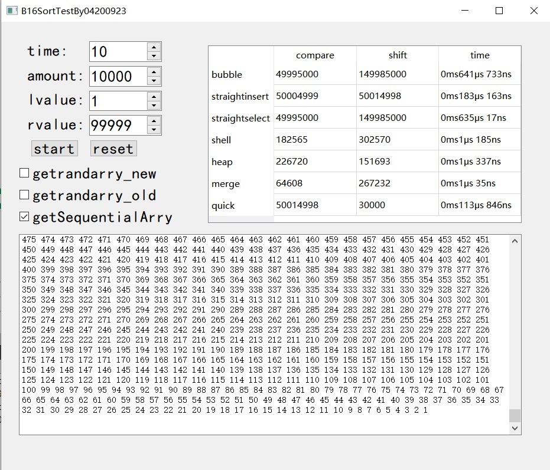
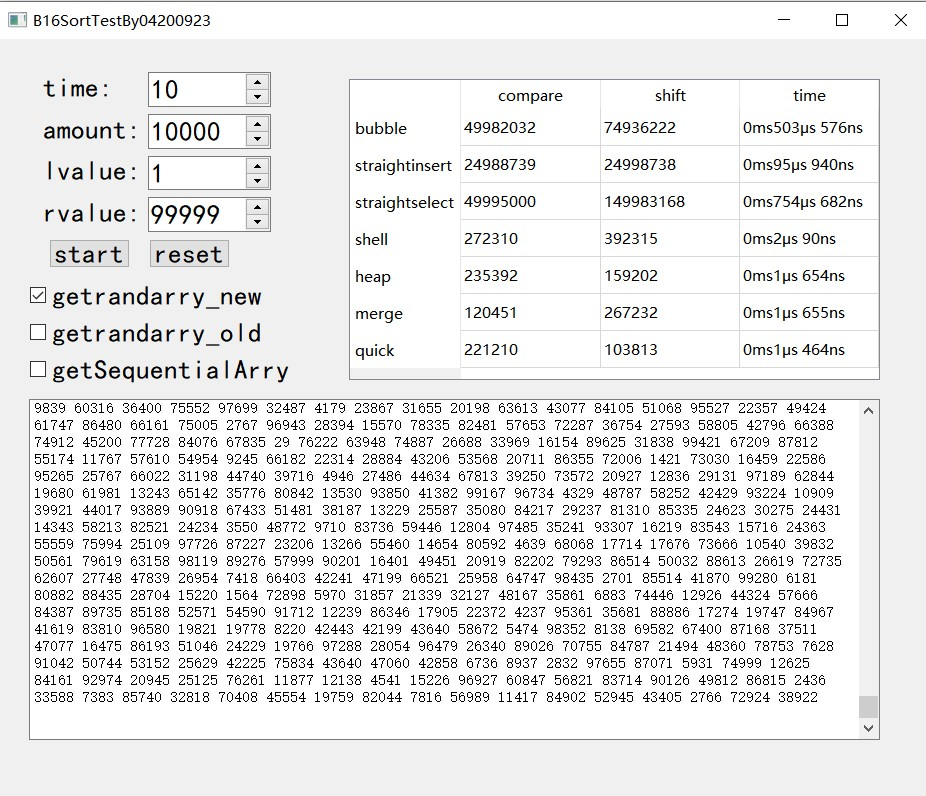
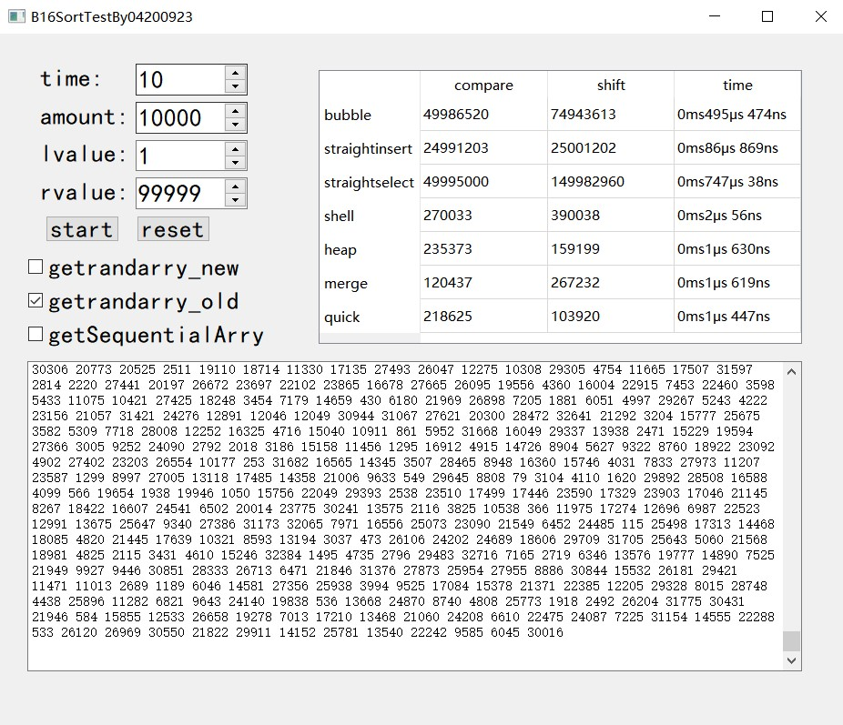

# Advantage and disadvantage analysis of seven internal sorting algorithms based on C++ (Qt implementation front-end)  

## 1 Preface

- Freshman year of c++ basic contact with the bubbling sort, thought the bubbling sort is already a quality sorting algorithm, the results of the sophomore year when the start of the study "data structures and algorithms" after the course only to realise that, the original bubbling sort is just a simple implementation of the sorting algorithm, which does not have a little bit of an advantage in the speed of execution. As I got deeper into the study and came into contact with more sorting algorithms, I found that the performance analysis of the internal sorting algorithms in the textbooks only emphasised the time complexity of the algorithms and whether they were stable or not, and could not visually reflect the performance advantages and disadvantages of the sorting algorithms.  

- Therefore, in order to deepen the understanding of each internal sorting algorithm, I chose the topic of "Comparison of Internal Sorting Algorithms" for my course design in the first semester of my sophomore year. In this paper, we mainly talk about how to achieve the performance advantages and disadvantages of the seven major internal sorting algorithms, omitting the analysis of the implementation of these seven major internal sorting algorithms.

## 2 Requirements Analysis

2.1 General Objectives

#### 2.1.1 Seven Internal Sorting Algorithms

- Implement Bubble Sort, Direct Insertion Sort, Simple Selection Sort, Hill Sort, Heap Sort, Subsumption Sort and Quick Sort using C++. At the same time in the implementation of the sorting algorithm function to add three parameters: the number of comparisons of keywords and the number of moves (keyword exchange counted as three moves) and sorting algorithm running time. And return these three parameters.  

#### 2.1.2 Generate random number sequence

- Implement the function of batch generation of random numbers, the generated random numbers need to be evenly distributed, and try to avoid the occurrence of consecutive identical numbers.

#### 2.1.3 Generate a sequence of inverted numbers.

- Generate a sequence of strictly inverted numbers for analysing the performance of various sorting algorithms in the face of the worst-case scenario.

#### 2.1.4 Front-end interface

1. implement a clear front-end interface for the user to set up the programme: number of runs, length of the random number sequence, left value of the random number, right value of the random number, and type of random number generation algorithm. 2. display the random number sequence generated by the programme.  
2. display the random number sequence generated by the programme. 3.  
3. displays the number of comparisons and moves (keyword exchange counts as 3 moves) for the keywords corresponding to Bubble Sort, Direct Insertion Sort, Simple Selection Sort, Hill Sort, Heap Sort, Merge Sort, and Rapid Sort as well as the running time of the sorting algorithm.

### 2.2 Data requirements

- Record the sequence of random numbers generated by the program, and display the number of comparisons and moves (keyword exchange counts as 3 moves) of the keywords corresponding to Bubble Sort, Direct Insertion Sort, Simple Selection Sort, Hill Sort, Heap Sort, Merge Sort, and Rapid Sort, as well as the running time of the sorting algorithm.

2.3 Performance requirements

- The front-end and back-end of the programme need to work closely together to run smoothly, while the output of each parameter is accurate and the display position is convenient for comparison. At the same time, the random number sequence should be of the order of 10,000, otherwise the data will not be meaningful when analysing the strengths and weaknesses of the sorting algorithm.

3 System Design and Implementation

### 3.1 Generate random numbers

3.1.1 Calling standard functions in C to generate a sequence of random numbers

```c++
template <class Type>
void getrandarry_old(Type R[], int N, int lvalue, int rvalue)
{
    for(int i = 0; i < N; i ++)
        R[i] = (rand() % (rvalue - lvalue + 1) ) + lvalue;
}
```

- The getrandarry_old function uses the standard C function rand to generate random numbers with a range restriction on the random numbers generated. The method is simple and straightforward and introduces no additional dependencies or complexity. It can be used in environments that do not support the C++ standard library and has good compatibility.  

- However, the method has the effect of generating a sequence of random numbers that are not uniformly distributed, which may result in certain values occurring consecutively, as well as certain values occurring at high or low frequencies. Such a sequence of random numbers is not conducive to the later analysis of the advantages and disadvantages of the seven internal sorting algorithms.

#### 3.1.2 Calling C++ Standard Library Classes to Generate Random Number Sequences

```c++
template <class Type>
void getrandarry_new(Type R[], int N, int lvalue, int rvalue)
{
    default_random_engine e;
    uniform_int_distribution<int> u(lvalue,rvalue);
    e.seed(time(0));
    for(int i = 0; i < N; i ++)
        R[i] = u(e);
}
```

- The getrandarry_new function uses the default_random_engine and uniform_int_distribution classes from the C++ standard library to generate random numbers. It first creates a default_random_engine object e, and then creates a uniformly distributed integer distribution object u with specified ranges of minimum and maximum values. Next, the function initialises the random number engine using the current time as a seed and uses the distribution object u in a loop to generate random numbers and assign them to array elements.  
- The getrandarry_new function provides better randomness and distribution. It helps to improve the credibility of the subsequent analysis of the strengths and weaknesses of the internal sorting algorithm.

#### 3.1.3 Generating an inverted sequence

```c++
template <class Type>
void getSequentialArry(Type R[], int N)
{
    for(int i = 0; i < N; i ++)
        R[i] = N - i;
}
```


### 3.2 Collection of performance metrics for sorting algorithms (using the bubble sort algorithm as an example)

```c++
typedef long long LL; 

template <class Type>
void bubblesort(Type R[], int size, LL &compare, LL &shift, LL &time)
{
    auto start = steady_clock::now();
    int i, j;
    bool flag = true;
    for(i = 1; i < size && flag; i ++)
    {
        flag = false;
        for(j = 0; j < size - i; j ++)
        {
            compare ++;
            if(R[j + 1] < R[j])
            {
                shift += 3;
                swap(R[j + 1], R[j]);
                flag = true;
            }
        }
    }
    auto end = steady_clock::now();
    auto t = duration_cast<microseconds>(end - start);
    time = t.count();
}
```

Bubbling sort should be the first internal sorting algorithm that CS students come across, the algorithm is simple and clear, which is beneficial for me to elaborate on how to implement the collection of sorting algorithm performance metrics.

1. the parameter compare is used to count the number of operations of comparing the sizes of the two algorithms, this parameter can reflect the efficiency of this sorting algorithm to some extent. 2. the parameter shift is used to count the number of variable exchanges.

2. the parameter shift is used to count the number of variable swaps, which can reflect the memory consumption of the sorting algorithm to a certain extent.

3. start records the start time of the sorting algorithm obtained by calling C++11's steady_clock class, and end records the end time of the sorting algorithm. 4.

4. The parameter t is obtained by calculating the difference between end and start, and t clearly reflects the execution speed of the sorting algorithm.

### 3.3 Implementation of the seven internal sorting algorithms

```c++
typedef long long LL; 
```

The performance of the program requires that the number of sequences to be sorted should reach more than 10,000, which leads to some sorting algorithms in the value of the parameter compare and parameter shift may exceed the limit of the int type, so the use of long long type to store these parameters, and in order to simplify the code to use typedef for the long long definition of the alias LL. 

3.3.1 Bubble Sorting

```c++
template <class Type>
void bubblesort(Type R[], int size, LL &compare, LL &shift, LL &time)
{
    auto start = steady_clock::now();
    int i, j;
    bool flag = true;
    for(i = 1; i < size && flag; i ++)
    {
        flag = false;
        for(j = 0; j < size - i; j ++)
        {
            compare ++;
            if(R[j + 1] < R[j])
            {
                shift += 3;
                swap(R[j + 1], R[j]);
                flag = true;
            }
        }
    }
    auto end = steady_clock::now();
    auto t = duration_cast<microseconds>(end - start);
    time = t.count();
}
```

#### 3.3.2 Direct Insertion Sort

```c++
template <class Type>
void straightinsertsort(Type R[], int size, LL &compare, LL &shift, LL &time)
{
    auto start = steady_clock::now();
    int pos, j;
    Type tmp;
    for(pos = 1; pos < size; pos ++)
    {
        tmp = R[pos];
        shift ++;
        for(j = pos - 1; j >= 0 && tmp < R[j]; j --)
        {
            R[j + 1] = R[j];
            shift ++;
            compare ++;
        }
        compare ++;
        R[j + 1] = tmp;
        shift ++;
    }
    auto end = steady_clock::now();
    auto t = duration_cast<microseconds>(end - start);
    time = t.count();
}
```

#### 3.3.3 Simple Selection Sort

```c++
template <class Type>
void straightselectsort(Type R[], int size, LL &compare, LL &shift, LL &time)
{
    auto start = steady_clock::now();

    int pos, min, j;
    for(pos = 0; pos < size - 1; pos ++)
    {
        min = pos;
        for(j = pos + 1; j < size; j ++)
        {
            compare ++;
            if(R[j] < R[min]) min = j;
            if(pos != min)
            {
                shift +=3;
                swap(R[pos], R[min]);
            }

        }
    }
    auto end = steady_clock::now();
    auto t = duration_cast<microseconds>(end - start);
    time = t.count();
}
```

#### 3.3.4 Hill Sort

```c++
template <class Type>
void shellsort (Type R[], int size, LL &compare, LL &shift, LL &time)
{
    auto start = steady_clock::now();
    int gap, pos, j;
    Type tmp;
    for(gap = size / 2; gap > 0; gap /= 2)
        for(pos = gap; pos < size; pos ++)
        {
            tmp = R[pos];
            shift ++;
            for(j = pos - gap; j >= 0 && R[j] > tmp; j -= gap)
            {
                R[j + gap] = R[j];
                shift ++;
                compare ++;
            }
            compare ++;
            R[j + gap] = tmp;
            shift ++;
        }
    auto end = steady_clock::now();
    auto t = duration_cast<microseconds>(end - start);
    time = t.count();
}
```

#### 3.3.5 Heap Sort

```c++
template <class Type>
void siftdown(Type R[], int pos, int size, LL &compare, LL &shift)
{
    int child;
    Type tmp = R[pos];
    for( ; pos * 2 + 1 < size; pos = child)
    {
        child = pos * 2 + 1;
        compare ++;
        if(child != size - 1 && R[child + 1] > R[child])
        {
            child ++;
        }
        compare ++;
        if(R[child] > tmp)
        {
            R[pos] = R[child];
            shift ++;
        }
        else break;
    }
    R[pos] = tmp;
    shift ++;
}

template <class Type>
void heapsort(Type R[], int size, LL &compare, LL &shift, LL &time)
{
    auto start = steady_clock::now();
    int i;
    for(i = size / 2 - 1; i >= 0; i --)
    {
        siftdown(R, i, size, compare, shift);
    }
    for(i = size - 1; i > 0; i --)
    {
        swap(R[0], R[i]);
        shift +=3;
        siftdown(R, 0, i, compare, shift);
    }
    auto end = steady_clock::now();
    auto t = duration_cast<microseconds>(end - start);
    time = t.count();
}
```

#### 3.3.6 Merge Sort

```c++
template <class Type>
void merge(Type R[], int left, int right, LL &compare, LL &shift)
{
    Type tmp[right - left + 1];
    if(left >= right) return;

    Type mid = left + right >> 1;
    merge(R, left, mid, compare, shift);
    merge(R, mid + 1, right, compare, shift);

    int k = 0;
    int i = left, j = mid + 1;
    while(i <= mid && j <= right)
    {
        compare ++;
        if(R[i] <= R[j]) tmp[k ++] = R[i ++];
        else tmp[k ++] = R[j ++];
        shift ++;
    }
    while(i <= mid)
    {
        tmp[k ++] = R[i ++];
        shift ++;
    }
    while(j <= right)
    {
        tmp[k ++] = R[j ++];
        shift ++;
    }

    for(int i = left, j = 0; i <= right; i ++, j ++)
    {
        R[i] = tmp[j];
        shift ++;
    }

}

template <class Type>
void mergesort(Type R[], int left, int right, LL &compare, LL &shift, LL &time)
{
    auto start = steady_clock::now();
    merge(R, left, right - 1, compare, shift);
    auto end = steady_clock::now();
    auto t = duration_cast<microseconds>(end - start);
    time = t.count();
}
```

It is worth noting that in the implementation of the merge function in the merge function needs to use the function itself recursive call, which leads to the merge function can not be achieved in the merge function of the entire sorting process of the time-consuming calculations, so in the mergesort function before and after the operation of the merge function call, respectively, plus:

```c++
auto start = steady_clock::now();
```

and

```c++
auto end = steady_clock::now();
```

In order to achieve a time-consuming computation of the entire subsumption sort. The fast sort algorithm is the same.


#### 3.3.7 Quick Sort

```c++
template <class Type>
void quick(int left, int right, Type R[], LL &compare, LL &shift)
{
    if(left >= right ) return;
    int i = left, j = right - 1;
    Type base = R[left];
    while(i < j)
    {
        while(R[j] >= base && i < j)
        {
            compare ++;
            j --;
        }
        compare ++;
        while(R[i] <= base && i < j)
        {
            compare ++;
            i ++;
        }
        compare ++;
        if(i < j)
        {
            swap(R[i], R[j]);
            shift +=3;
        }
    }
    swap(R[left], R[i]);
    shift +=3;
    quick(left, i, R, compare, shift);
    quick(i + 1, right, R, compare, shift);
}

template <class Type>
void quicksort(Type R[], int left, int right, LL &compare, LL &shift, LL &time)
{
    auto start = steady_clock::now();
    quick(left, right, R, compare, shift);
    auto end = steady_clock::now();
    auto t = duration_cast<microseconds>(end - start);
    time = t.count();
}
```

The principle of time-consuming statistics is the same as that of the merge sort algorithm.

### 3.4 Front-end interface

Qt is a cross-platform C++ GUI application framework. It provides application developers with all the functionality they need to build graphical interfaces. It is fully object oriented, easily extensible, and allows true component programming. Qt is used in this application to do the ui interface of the project, the specific implementation will not be repeated.


- Area ① provides the user to set the number of tests (time), the length of the sequence to be sorted (amount), the left value of the generated random number sequence (lvalue) and the right value of the generated random number sequence (rvalue).
- Area ② is the button to run the programme (start) and the parameter reset button (reset) in area ①.
- Area ③ provides the user with three options for generating the sequence to be sorted, namely, non-uniform random numbers generated by calling the C standard language library (getrandarry_new), uniform random number sequences generated by calling the classes of the C++ standard library (getrandarry_old), and generating completely inverted sequences (getSequentialArry).
- Area 4 presents the number of comparisons and shifts of the keywords corresponding to Bubble Sort, Direct Insertion Sort, Simple Selection Sort, Hill Sort, Heap Sort, Merge Sort, and Rapid Sort and the running time of the sorting algorithms in the form of a table.
- Area ⑤ prints out the sequence to be sorted generated by the programme.

## 4 Analysing the conclusions of the procedure

Before we begin let's look at the textbook analysis of the strengths and weaknesses of the seven internal sorting algorithms

|     sorting algorithm     | Best time complexity | Average time complexity | worst-case time complexity |  space complexity  | stable or not |
| :-----------------------: | :------------------: | :---------------------: | :------------------------: | :----------------: | :-----------: |
| **Direct Insertion Sort** |        $O(N)$        |        $O(N^2)$         |          $O(N^2)$          |       $O(1)$       |    stable     |
|       **Hill Sort**       |        $O(N)$        |      $O(N^{1.3})$       |          $O(N^2)$          |       $O(1)$       |   unstable    |
| **Simple Selection Sort** |        $O(N)$        |        $O(N^2)$         |          $O(N^2)$          |       $O(1)$       |   unstable    |
|       **Heap Sort**       |    $(N*log_{2}N)$    |     $(N*log_{2}N)$      |       $(N*log_{2}N)$       |       $O(1)$       |   unstable    |
|      **Bubble Sort**      |        $O(N)$        |        $O(N^2)$         |          $O(N^2)$          |       $O(1)$       |    stable     |
|      **Quick Sort**       |    $(N*log_{2}N)$    |     $(N*log_{2}N)$      |          $O(N^2)$          | $O(log_{2}n)-O(n)$ |   unstable    |
|      **Merge Sort**       |    $(N*log_{2}N)$    |     $(N*log_{2}N)$      |       $(N*log_{2}N)$       |       $O(n)$       |   unstable    |

### 4.1 Operational results







### 4.2 Test conclusions

#### 4.2.1 Bubble Sort

- Advantage: Simple to implement, no extra storage space needed, stable.
- Disadvantages: long execution time due to high number of comparisons and moves, not applicable to large-scale data.

#### 4.2.2 Direct Insertion Sort

- Advantage: better for partially ordered data. Simple to implement and stable.
- Disadvantage: poor performance on large-scale disordered data.

#### 4.2.3 Simple Selection Sort

- Advantage: does not take up extra memory space, works better on small-scale data sorting.
- Disadvantage: more comparisons, not applicable to large scale data resulting in long execution time.

#### 4.2.4 Hill Sort

- Advantage: In some cases, it outperforms Simple Insertion Sort and Bubble Sort.
- Weaknesses: for different incremental sequences, the performance is different and it is difficult to choose the right incremental sequence.

#### 4.2.5 Heap Sort

- Advantage: More suitable for large-scale data than other O(n log n) sorting algorithms. No additional storage space is required.
- Disadvantages: poor performance for small-scale data, unstable.

#### 4.2.6 Merge Sorting

- Advantage: Stable and suitable for large-scale data. It is also more suitable for non-random storage structures such as chained lists.
- Disadvantages: takes up extra storage space, poor performance for small-scale data.

#### 4.2.7 Quick Sort

- Advantage: Better performance on average, suitable for large-scale data. Does not require additional storage space.
- Disadvantage: worse performance in worst case scenario, may lead to stack overflow.
