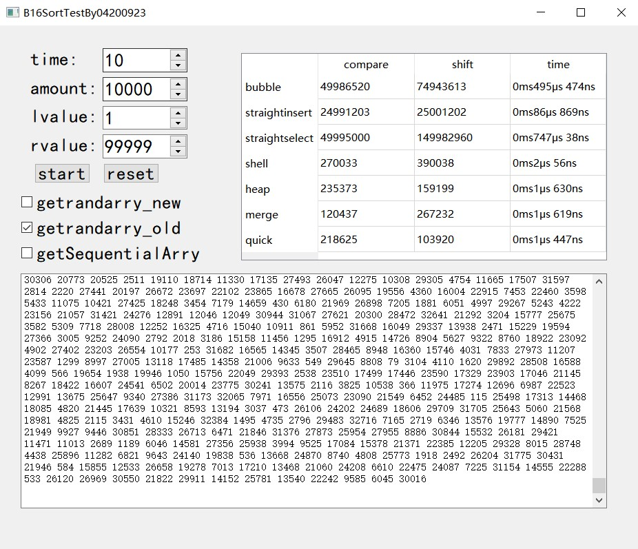

# 基于C++对七大内部排序算法进行优劣势分析（Qt实现前端）  

## 1 前言

- 大一学c++基础的时候就接触了冒泡排序，当时以为冒泡排序就已经是一个优质的排序算法，结果到了大二的时候开始学习《数据结构和算法》这门课之后才意识到原来冒泡排序只是一个实现简单的排序算法，它在执行速度上没有一点优势。随着学习的深入接触到了更多种排序算法的同时发现了教科书中对内部排序算法的性能分析只强调了算法的时间复杂度和是否稳定，并不能直观的体现排序算法的性能优劣。  
- 于是乎，为了加深各个内部排序算法的认识，我在大二上学期的课程设计选择了“内部排序算法比较”这一课题。本文主要讲述如何实现七大内部排序算法性能的优劣分析，省略对这七大内部排序算法的实现分析。  

## 2 需求分析

### 2.1 总体目标

#### 2.1.1七大内部排序算法

- 使用C++实现冒泡排序、直接插入排序、简单选择排序、希尔排序、堆排序、归并排序和快速排序。同时在排序算法的实现函数中加入三个参数：关键字的比较次数和移动次数（关键字交换计为3次移动）以及排序算法运行时间。并且返回这三个参数。  

#### 2.1.2 生成随机数序列

- 实现批量生成随机数数功能，生成随机数需要分布均匀，尽量避免出现连续相同数的情况。

#### 2.1.3 生成倒序数序列

- 实现生成严格倒序的序列，用于分析各个排序算法在面对最坏情况时的性能优劣。

#### 2.1.4 前端界面

1. 实现清晰的前端界面方便用户设定程序：运行次数、随机数序列长度、随机数左值、随机数右值以及随机数生成算法类型。  
2. 显示程序生成的随机数序列。  
3. 分别显示冒泡排序、直接插入排序、简单选择排序、希尔排序、堆排序、归并排序和快速排序所对应的关键字的比较次数和移动次数（关键字交换计为3次移动）以及排序算法运行时间。

### 2.2 数据需求

- 记录程序所生成的随机数序列，以及显示冒泡排序、直接插入排序、简单选择排序、希尔排序、堆排序、归并排序和快速排序所对应的关键字的比较次数和移动次数（关键字交换计为3次移动）以及排序算法运行时间。

### 2.3 性能要求

- 需要程序前后端紧密配合流畅运行，同时各参数的输出精准，显示位置方便对比。同时随机数序列的数量级应该达到10000否则在对排序算法优劣势分析的时候数据并未参考意义。  

## 3 系统设计与实现

### 3.1 生成随机数

#### 3.1.1 调用C语言的标准函数生成随机数序列

```c++
template <class Type>
void getrandarry_old(Type R[], int N, int lvalue, int rvalue)
{
    for(int i = 0; i < N; i ++)
        R[i] = (rand() % (rvalue - lvalue + 1) ) + lvalue;
}
```

- getrandarry_old函数使用了C语言的标准函数rand来生成随机数，并对生成的随机数进行了范围限制。该方法简单直接，没有引入额外的依赖和复杂性。可以在不支持C++标准库的环境下使用，具有较好的兼容性。  
- 但是该方法有生成的随机数序列分布不够均匀，可能导致某些数值连续出现，以及某些数值高频或低频出现。这样的随机数序列不利于后期对七大内部排序算法优劣势分析。  

#### 3.1.2 调用C++标准库的类生成随机数序列

```c++
template <class Type>
void getrandarry_new(Type R[], int N, int lvalue, int rvalue)
{
    default_random_engine e;
    uniform_int_distribution<int> u(lvalue,rvalue);
    e.seed(time(0));
    for(int i = 0; i < N; i ++)
        R[i] = u(e);
}
```

- getrandarry_new函数使用了C++标准库中的default_random_engine和uniform_int_distribution类来生成随机数。它先创建一个默认的随机数引擎对象e，然后创建一个均匀分布的整数分布对象u，并指定范围为最小值和最大值。接下来，函数使用当前时间作为种子来初始化随机数引擎，并在循环中使用分布对象u来生成随机数，并将其赋值给数组元素。  
- getrandarry_new函数提供了更好的随机性和分布性。有利于提高后续内部排序算法优劣势分析的可信度。

#### 3.1.3 生成倒序序列

```c++
template <class Type>
void getSequentialArry(Type R[], int N)
{
    for(int i = 0; i < N; i ++)
        R[i] = N - i;
}
```


### 3.2 排序算法性能指标收集（以冒泡排序算法举例）

```c++
typedef long long LL; 

template <class Type>
void bubblesort(Type R[], int size, LL &compare, LL &shift, LL &time)
{
    auto start = steady_clock::now();//精确到纳秒
    int i, j;
    bool flag = true;
    for(i = 1; i < size && flag; i ++)
    {
        flag = false;
        for(j = 0; j < size - i; j ++)
        {
            compare ++;
            if(R[j + 1] < R[j])
            {
                shift += 3;
                swap(R[j + 1], R[j]);
                flag = true;
            }
        }
    }
    auto end = steady_clock::now();
    auto t = duration_cast<microseconds>(end - start);
    time = t.count();
}
```

冒泡排序应该是CS的学生第一个接触到的内部排序算法，该算法简单且清晰，有利于我阐述如何实现收集排序算法性能指标。

1. 参数compare用于统计算法中每一次两两比较的大小的操作次数，该参数可以一定程度上反应该排序算法的效率高低。
2. 参数shift用于统计变量交换次数，该参数可以一定程度上反应该排序算法的内存花销高低。
3. 参数start记录了通过调用C++11的steady_clock类来获取的该排序算法开始的时间点，参数end记录了该排序算法结束时间点。
4. 参数t通过计算end和start的差值获得，t可以清晰明了的反应了该排序算法的执行速度。  

### 3.3七大内部排序算法的实现

```c++
typedef long long LL; 
```

该程序性能要求待排序序列数量应达到10000以上这就导致了在某些排序算法中参数compare和参数shift的值有可能超出int类型的极限，所以使用long long类型存储这些参数，同时为了简化代码使用typedef为long long 定义别名LL。  

#### 3.3.1 冒泡排序

```c++
template <class Type>
void bubblesort(Type R[], int size, LL &compare, LL &shift, LL &time)
{
    auto start = steady_clock::now();//精确到纳秒
    int i, j;
    bool flag = true;
    for(i = 1; i < size && flag; i ++)
    {
        flag = false;
        for(j = 0; j < size - i; j ++)
        {
            compare ++;
            if(R[j + 1] < R[j])
            {
                shift += 3;
                swap(R[j + 1], R[j]);
                flag = true;
            }
        }
    }
    auto end = steady_clock::now();
    auto t = duration_cast<microseconds>(end - start);
    time = t.count();
}
```

#### 3.3.2 直接插入排序

```c++
template <class Type>
void straightinsertsort(Type R[], int size, LL &compare, LL &shift, LL &time)
{
    auto start = steady_clock::now();
    int pos, j;
    Type tmp;
    for(pos = 1; pos < size; pos ++)
    {
        tmp = R[pos];
        shift ++;
        for(j = pos - 1; j >= 0 && tmp < R[j]; j --)
        {
            R[j + 1] = R[j];
            shift ++;
            compare ++;
        }
        compare ++;
        R[j + 1] = tmp;
        shift ++;
    }
    auto end = steady_clock::now();
    auto t = duration_cast<microseconds>(end - start);
    time = t.count();
}
```

#### 3.3.3 简单选择排序

```c++
template <class Type>
void straightselectsort(Type R[], int size, LL &compare, LL &shift, LL &time)
{
    auto start = steady_clock::now();

    int pos, min, j;
    for(pos = 0; pos < size - 1; pos ++)
    {
        min = pos;
        for(j = pos + 1; j < size; j ++)
        {
            compare ++;
            if(R[j] < R[min]) min = j;
            if(pos != min)
            {
                shift +=3;
                swap(R[pos], R[min]);
            }

        }
    }
    auto end = steady_clock::now();
    auto t = duration_cast<microseconds>(end - start);
    time = t.count();
}
```

#### 3.3.4 希尔排序

```c++
template <class Type>
void shellsort (Type R[], int size, LL &compare, LL &shift, LL &time)
{
    auto start = steady_clock::now();
    int gap, pos, j;
    Type tmp;
    for(gap = size / 2; gap > 0; gap /= 2)
        for(pos = gap; pos < size; pos ++)
        {
            tmp = R[pos];
            shift ++;
            for(j = pos - gap; j >= 0 && R[j] > tmp; j -= gap)
            {
                R[j + gap] = R[j];
                shift ++;
                compare ++;
            }
            compare ++;
            R[j + gap] = tmp;
            shift ++;
        }
    auto end = steady_clock::now();
    auto t = duration_cast<microseconds>(end - start);
    time = t.count();
}
```

#### 3.3.5 堆排序

```c++
template <class Type>
void siftdown(Type R[], int pos, int size, LL &compare, LL &shift)
{
    int child;
    Type tmp = R[pos];
    for( ; pos * 2 + 1 < size; pos = child)
    {
        child = pos * 2 + 1;
        compare ++;
        if(child != size - 1 && R[child + 1] > R[child])
        {
            child ++;
        }
        compare ++;
        if(R[child] > tmp)
        {
            R[pos] = R[child];
            shift ++;
        }
        else break;
    }
    R[pos] = tmp;
    shift ++;
}

template <class Type>
void heapsort(Type R[], int size, LL &compare, LL &shift, LL &time)
{
    auto start = steady_clock::now();
    int i;
    for(i = size / 2 - 1; i >= 0; i --)
    {
        siftdown(R, i, size, compare, shift);
    }
    for(i = size - 1; i > 0; i --)
    {
        swap(R[0], R[i]);
        shift +=3;
        siftdown(R, 0, i, compare, shift);
    }
    auto end = steady_clock::now();
    auto t = duration_cast<microseconds>(end - start);
    time = t.count();
}
```

#### 3.3.6 归并排序

```c++
template <class Type>
void merge(Type R[], int left, int right, LL &compare, LL &shift)
{
    Type tmp[right - left + 1];
    if(left >= right) return;

    Type mid = left + right >> 1;
    merge(R, left, mid, compare, shift);
    merge(R, mid + 1, right, compare, shift);

    int k = 0;
    int i = left, j = mid + 1;
    while(i <= mid && j <= right)
    {
        compare ++;
        if(R[i] <= R[j]) tmp[k ++] = R[i ++];
        else tmp[k ++] = R[j ++];
        shift ++;
    }
    while(i <= mid)
    {
        tmp[k ++] = R[i ++];
        shift ++;
    }
    while(j <= right)
    {
        tmp[k ++] = R[j ++];
        shift ++;
    }

    for(int i = left, j = 0; i <= right; i ++, j ++)
    {
        R[i] = tmp[j];
        shift ++;
    }

}

template <class Type>
void mergesort(Type R[], int left, int right, LL &compare, LL &shift, LL &time)
{
    auto start = steady_clock::now();
    merge(R, left, right - 1, compare, shift);
    auto end = steady_clock::now();
    auto t = duration_cast<microseconds>(end - start);
    time = t.count();
}
```

&emsp;&emsp;值得注意的是在归并排序merge函数的实现中需要用到函数自身的递归调用，这就导致了无法在在merge函数中实现对整个排序过程中的耗时计算，所以在mergesort函数中调用merge函数操作的前后分别加上：

```c++
auto start = steady_clock::now();
```

和

```c++
auto end = steady_clock::now();
```

以实现对整个归并排序的耗时计算。快速排序算法同理。


#### 3.3.7 快速排序

```c++
template <class Type>
void quick(int left, int right, Type R[], LL &compare, LL &shift)
{
    if(left >= right ) return;
    int i = left, j = right - 1;
    Type base = R[left];
    while(i < j)
    {
        while(R[j] >= base && i < j)
        {
            compare ++;
            j --;
        }
        compare ++;
        while(R[i] <= base && i < j)
        {
            compare ++;
            i ++;
        }
        compare ++;
        if(i < j)
        {
            swap(R[i], R[j]);
            shift +=3;
        }
    }
    swap(R[left], R[i]);
    shift +=3;
    quick(left, i, R, compare, shift);
    quick(i + 1, right, R, compare, shift);
}

template <class Type>
void quicksort(Type R[], int left, int right, LL &compare, LL &shift, LL &time)
{
    auto start = steady_clock::now();
    quick(left, right, R, compare, shift);
    auto end = steady_clock::now();
    auto t = duration_cast<microseconds>(end - start);
    time = t.count();
}
```

耗时统计原理同归并排序算法。

### 3.4 前端界面

Qt是一个跨平台的C++图形用户界面应用程序框架。它为应用程序开发者提供建立图形界面所需的所有功能。它是完全面向对象的，很容易扩展，并且允许真正的组件编程。在本程序中使用了Qt做项目的ui界面，具体实现方式不在赘述。


- 区域①提供给用户设定测试次数(time)、待排序序列长度(amount)、生成随机数序列的左值(lvalue)和生成随机数序列的右值(rvalue)。
- 区域②为程序运行按钮(start)和区域①的参数重设按钮(reset)。
- 区域③为用户提供三种待排序序列的生成方式选项分别是调用c语言标准语言库生成的非均匀随机数(getrandarry_new)、调用c++标准库的类生成的均匀随机数序列(getrandarry_old)和生成完全倒序序列(getSequentialArry)。
- 区域④将冒泡排序、直接插入排序、简单选择排序、希尔排序、堆排序、归并排序和快速排序所对应的关键字的比较次(compare)数和移动次数(shift)以及排序算法运行时间(time)以表格的形式呈现出来。
- 区域⑤将程序生成的待排序序列打印出来。

## 4 程序结论分析

在开始前我们先来看一下教科书中对七大内部排序算法的优劣势分析

|     排序算法     | 最好时间复杂度 | 平均时间复杂度 | 最坏时间复杂度 |     空间复杂度     | 是否稳定 |
| :--------------: | :------------: | :------------: | :------------: | :----------------: | :------: |
| **直接插入排序** |     $O(N)$     |    $O(N^2)$    |    $O(N^2)$    |       $O(1)$       |   稳定   |
|   **希尔排序**   |     $O(N)$     |  $O(N^{1.3})$  |    $O(N^2)$    |       $O(1)$       |  不稳定  |
| **简单选择排序** |     $O(N)$     |    $O(N^2)$    |    $O(N^2)$    |       $O(1)$       |  不稳定  |
|    **堆排序**    | $(N*log_{2}N)$ | $(N*log_{2}N)$ | $(N*log_{2}N)$ |       $O(1)$       |  不稳定  |
|   **冒泡排序**   |     $O(N)$     |    $O(N^2)$    |    $O(N^2)$    |       $O(1)$       |   稳定   |
|   **快速排序**   | $(N*log_{2}N)$ | $(N*log_{2}N)$ |    $O(N^2)$    | $O(log_{2}n)-O(n)$ |  不稳定  |
|   **归并排序**   | $(N*log_{2}N)$ | $(N*log_{2}N)$ | $(N*log_{2}N)$ |       $O(n)$       |   稳定   |

### 4.1  运行结果




### 4.2 测试结论

#### 4.2.1 冒泡排序

- 优势：实现简单，不需要额外的存储空间，稳定。
- 劣势：比较和移动次数较多导致执行时间长，不适用于大规模数据。

#### 4.2.2 直接插入排序

- 优势：对于部分有序的数据，效果较好。实现简单，稳定。
- 劣势：在大规模乱序数据上性能不佳。

#### 4.2.3 简单选择排序

- 优势：不占用额外的内存空间，对小规模数据排序效果较好。
- 劣势：比较次数较多，不适用于大规模数据导致执行时间长。

#### 4.2.4 希尔排序

- 优势：在某些情况下，其性能优于简单插入排序和冒泡排序，执行速度快。
- 劣势：对于不同的增量序列，性能表现不同，难以选择合适的增量序列。

#### 4.2.5 堆排序

- 优势：相对其他O(n log n)排序算法更适用于大规模数据。不需要额外的存储空间。
- 劣势：对于小规模数据性能较差，不稳定。

#### 4.2.6 归并排序

- 优势：稳定，适用于大规模数据。对于链表等非随机存储结构也较为适用。
- 劣势：占用额外的存储空间，对于小规模数据性能较差。

#### 4.2.7 快速排序

- 优势：在平均情况下性能较好，适用于大规模数据。不需要额外的存储空间。
- 劣势：在最坏情况下性能较差，可能导致栈溢出。
